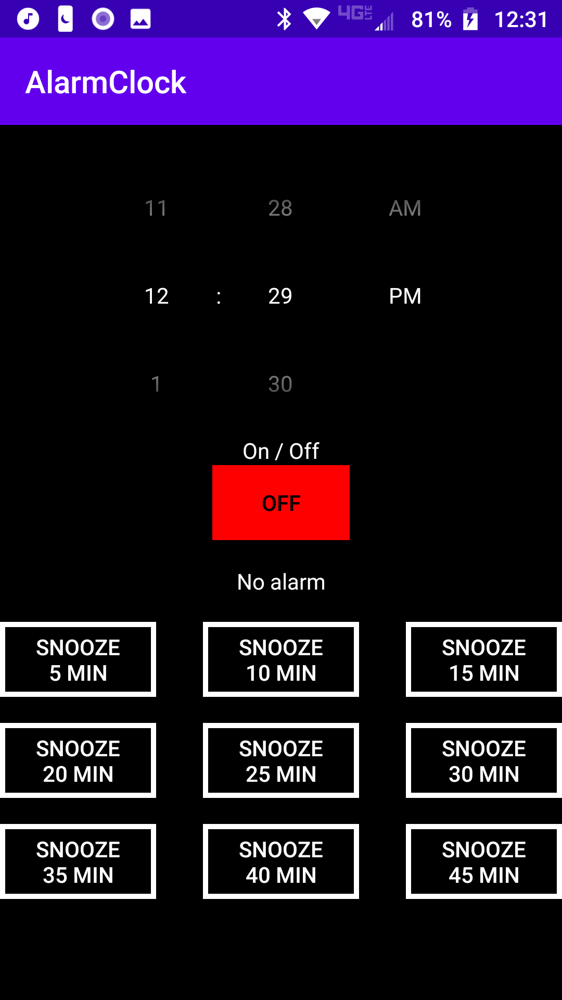
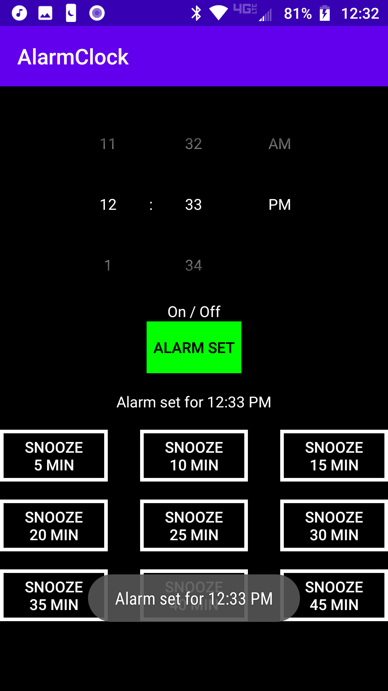
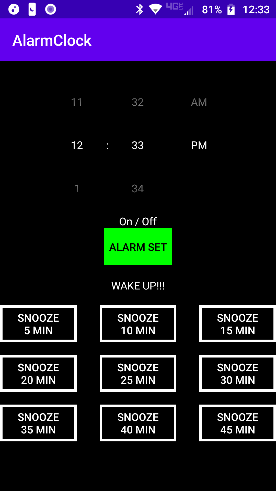
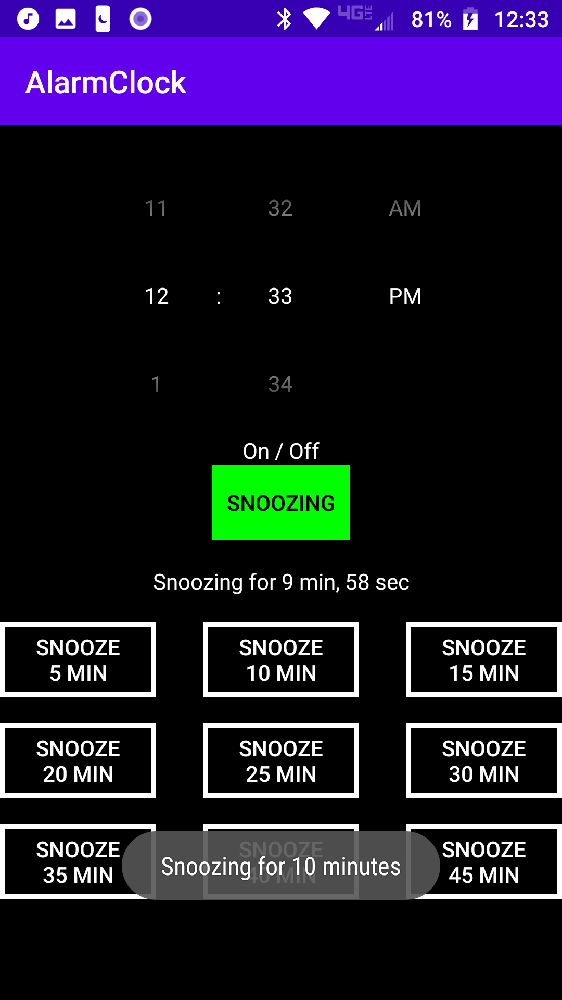
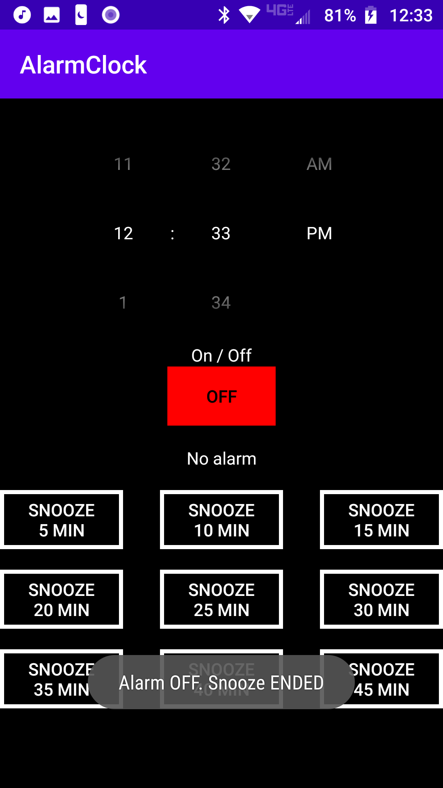

# AlarmClock

AlarmClock is a custom Android alarm clock app that uses the system default Alarm ringtone.  It uses a dark theme and allows the user to snooze the alarm for various lengths, compared to one specific length as is the case in the default Android Alarm Clock app.

# Requirements

Alarm Clock is developed for Android versions **8.0** / API Level **26** and above.

## Home Screen / No Alarm Set

## Setting the alarm

Use the scroll-able time picker and the On/Off button to set the alarm.

## Alarm Ringing

## Snoozing the alarm
When the alarm rings, press any of the snooze buttons to Snooze for the desired amount of time.  Alternatively, if the alarm is not set, the Snooze buttons can be used to quickly set an alarm.

## Stopping the alarm
Use the On/Off button to turn the alarm or snooze off.

